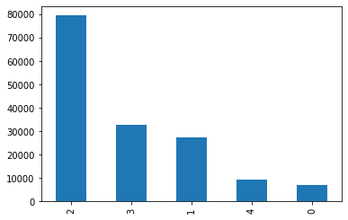

# Obtain the datasets from kaggle 
Using KaggleAPI to obtain the [Sentiment Analysis on Movie Review Datasets](https://www.kaggle.com/c/sentiment-analysis-on-movie-reviews/data)


```python
!pip install -q kaggle
```


```python
# upload the Kaggle API Json file to access the datasets
from google.colab import files
files.upload()

```


<input type="file" id="files-9d7d8c1d-a389-4baf-976c-65d70b3cdb3d" name="files[]" multiple disabled
   style="border:none" />
<output id="result-9d7d8c1d-a389-4baf-976c-65d70b3cdb3d">
 Upload widget is only available when the cell has been executed in the
 current browser session. Please rerun this cell to enable.
 </output>
 <script src="/nbextensions/google.colab/files.js"></script> 


    Saving kaggle.json to kaggle.json


    {'kaggle.json': b'{"username":"zhiyil5","key":"585c5806655d565e36eae6bd814dee41"}'}


[Using Kaggle API on Colab](https://www.kaggle.com/general/74235)


```python
! mkdir ~/.kaggle
! cp kaggle.json ~/.kaggle/
! chmod 600 ~/.kaggle/kaggle.json
! kaggle datasets list

```

    ref                                                 title                                  size  lastUpdated          downloadCount  voteCount  usabilityRating  
    --------------------------------------------------  ------------------------------------  -----  -------------------  -------------  ---------  ---------------  
    ruchi798/data-science-job-salaries                  Data Science Job Salaries               7KB  2022-06-15 08:59:12          17615        549  1.0              
    aravindas01/monkeypox-cases-countrywise-data        MonkeyPox Cases_Countrywise Data        6KB  2022-08-10 17:12:36            524         27  0.9117647        
    faryarmemon/usa-housing-market-factors              U.S. Housing Market Factors            32KB  2022-08-03 02:19:31            425         30  1.0              
    zzettrkalpakbal/full-filled-brain-stroke-dataset    Brain stroke prediction dataset        52KB  2022-07-16 09:57:08           1968         62  0.9705882        
    himanshunakrani/student-study-hours                 Student Study Hours                    276B  2022-07-20 13:17:29           1497         57  1.0              
    jillanisofttech/brain-stroke-dataset                Brain Stroke Dataset                   47KB  2022-08-04 18:02:56            666         29  0.9705882        
    nancyalaswad90/diamonds-prices                      Diamonds Prices                       711KB  2022-07-09 14:59:21           1942         88  1.0              
    erqizhou/students-data-analysis                     Students Data Analysis                  2KB  2022-07-20 03:54:13            776         28  1.0              
    dansbecker/melbourne-housing-snapshot               Melbourne Housing Snapshot            451KB  2018-06-05 12:52:24          92793       1118  0.7058824        
    gabrielabilleira/football-manager-2022-player-data  Football Manager 2022 Player Data      94KB  2022-07-26 09:49:50            546         28  1.0              
    mukuldeshantri/ecommerce-fashion-dataset            E-commerce Dataset with 30K Products  546KB  2022-07-08 12:28:18           2259         68  1.0              
    datasnaek/youtube-new                               Trending YouTube Video Statistics     201MB  2019-06-03 00:56:47         181067       4628  0.7941176        
    zynicide/wine-reviews                               Wine Reviews                           51MB  2017-11-27 17:08:04         164231       3348  0.7941176        
    residentmario/ramen-ratings                         Ramen Ratings                          40KB  2018-01-11 16:04:39          35106        802  0.7058824        
    rtatman/188-million-us-wildfires                    1.88 Million US Wildfires             168MB  2020-05-12 21:03:49          20978       1026  0.8235294        
    datasnaek/chess                                     Chess Game Dataset (Lichess)            3MB  2017-09-04 03:09:09          30770       1023  0.8235294        
    jpmiller/publicassistance                           US Public Food Assistance             703KB  2020-08-21 16:51:18          16824        401  0.9117647        
    dansbecker/powerlifting-database                    powerlifting-database                   9MB  2019-04-30 21:07:41           5207         64  0.5882353        
    nasa/kepler-exoplanet-search-results                Kepler Exoplanet Search Results         1MB  2017-10-10 18:26:59          10720        667  0.8235294        
    residentmario/things-on-reddit                      Things on Reddit                       16MB  2017-10-26 14:10:15           8769        219  0.5882353        


```python
!kaggle competitions download -c 'sentiment-analysis-on-movie-reviews'
```

    Downloading sentiment-analysis-on-movie-reviews.zip to /content
      0% 0.00/1.90M [00:00<?, ?B/s]
    100% 1.90M/1.90M [00:00<00:00, 161MB/s]


```python
#unzip the files on Colab
!unzip sentiment-analysis-on-movie-reviews.zip
```

    Archive:  sentiment-analysis-on-movie-reviews.zip
      inflating: sampleSubmission.csv    
      inflating: test.tsv.zip            
      inflating: train.tsv.zip           


```python
!unzip train.tsv.zip
!unzip test.tsv.zip
```

    Archive:  train.tsv.zip
      inflating: train.tsv               
    Archive:  test.tsv.zip
      inflating: test.tsv                


# Prepare Data
Load the data into Pandas Dataframes


```python
import pandas as pd

df = pd.read_csv("train.tsv", sep="\t")
df.head()
```


  <div id="df-b4b09dc7-e80d-440c-a160-c8b0fd3755b5">
    <div class="colab-df-container">
      <div>
<style scoped>
    .dataframe tbody tr th:only-of-type {
        vertical-align: middle;
    }

    .dataframe tbody tr th {
        vertical-align: top;
    }

    .dataframe thead th {
        text-align: right;
    }
</style>
<table border="1" class="dataframe">
  <thead>
    <tr style="text-align: right;">
      <th></th>
      <th>PhraseId</th>
      <th>SentenceId</th>
      <th>Phrase</th>
      <th>Sentiment</th>
    </tr>
  </thead>
  <tbody>
    <tr>
      <th>0</th>
      <td>1</td>
      <td>1</td>
      <td>A series of escapades demonstrating the adage ...</td>
      <td>1</td>
    </tr>
    <tr>
      <th>1</th>
      <td>2</td>
      <td>1</td>
      <td>A series of escapades demonstrating the adage ...</td>
      <td>2</td>
    </tr>
    <tr>
      <th>2</th>
      <td>3</td>
      <td>1</td>
      <td>A series</td>
      <td>2</td>
    </tr>
    <tr>
      <th>3</th>
      <td>4</td>
      <td>1</td>
      <td>A</td>
      <td>2</td>
    </tr>
    <tr>
      <th>4</th>
      <td>5</td>
      <td>1</td>
      <td>series</td>
      <td>2</td>
    </tr>
  </tbody>
</table>
</div>
      <button class="colab-df-convert" onclick="convertToInteractive('df-b4b09dc7-e80d-440c-a160-c8b0fd3755b5')"
              title="Convert this dataframe to an interactive table."
              style="display:none;">

  <svg xmlns="http://www.w3.org/2000/svg" height="24px"viewBox="0 0 24 24"
       width="24px">
    <path d="M0 0h24v24H0V0z" fill="none"/>
    <path d="M18.56 5.44l.94 2.06.94-2.06 2.06-.94-2.06-.94-.94-2.06-.94 2.06-2.06.94zm-11 1L8.5 8.5l.94-2.06 2.06-.94-2.06-.94L8.5 2.5l-.94 2.06-2.06.94zm10 10l.94 2.06.94-2.06 2.06-.94-2.06-.94-.94-2.06-.94 2.06-2.06.94z"/><path d="M17.41 7.96l-1.37-1.37c-.4-.4-.92-.59-1.43-.59-.52 0-1.04.2-1.43.59L10.3 9.45l-7.72 7.72c-.78.78-.78 2.05 0 2.83L4 21.41c.39.39.9.59 1.41.59.51 0 1.02-.2 1.41-.59l7.78-7.78 2.81-2.81c.8-.78.8-2.07 0-2.86zM5.41 20L4 18.59l7.72-7.72 1.47 1.35L5.41 20z"/>
  </svg>
      </button>

  <style>
    .colab-df-container {
      display:flex;
      flex-wrap:wrap;
      gap: 12px;
    }

    .colab-df-convert {
      background-color: #E8F0FE;
      border: none;
      border-radius: 50%;
      cursor: pointer;
      display: none;
      fill: #1967D2;
      height: 32px;
      padding: 0 0 0 0;
      width: 32px;
    }

    .colab-df-convert:hover {
      background-color: #E2EBFA;
      box-shadow: 0px 1px 2px rgba(60, 64, 67, 0.3), 0px 1px 3px 1px rgba(60, 64, 67, 0.15);
      fill: #174EA6;
    }

    [theme=dark] .colab-df-convert {
      background-color: #3B4455;
      fill: #D2E3FC;
    }

    [theme=dark] .colab-df-convert:hover {
      background-color: #434B5C;
      box-shadow: 0px 1px 3px 1px rgba(0, 0, 0, 0.15);
      filter: drop-shadow(0px 1px 2px rgba(0, 0, 0, 0.3));
      fill: #FFFFFF;
    }
  </style>

      <script>
        const buttonEl =
          document.querySelector('#df-b4b09dc7-e80d-440c-a160-c8b0fd3755b5 button.colab-df-convert');
        buttonEl.style.display =
          google.colab.kernel.accessAllowed ? 'block' : 'none';

        async function convertToInteractive(key) {
          const element = document.querySelector('#df-b4b09dc7-e80d-440c-a160-c8b0fd3755b5');
          const dataTable =
            await google.colab.kernel.invokeFunction('convertToInteractive',
                                                     [key], {});
          if (!dataTable) return;

          const docLinkHtml = 'Like what you see? Visit the ' +
            '<a target="_blank" href=https://colab.research.google.com/notebooks/data_table.ipynb>data table notebook</a>'
            + ' to learn more about interactive tables.';
          element.innerHTML = '';
          dataTable['output_type'] = 'display_data';
          await google.colab.output.renderOutput(dataTable, element);
          const docLink = document.createElement('div');
          docLink.innerHTML = docLinkHtml;
          element.appendChild(docLink);
        }
      </script>
    </div>
  </div>


Check the distribution of the sentiment classes to see if there are any class imbalancces


```python
df["Sentiment"].value_counts().plot(kind="bar")
```


    <matplotlib.axes._subplots.AxesSubplot at 0x7f09c12b4cd0>


    

    


For BERT, we need to tokenize the text to create two input tensors, the input IDs, and attention mask <br>

The dimensions will be len(df) * 512 because 512 is the sequence length of the tokenized sequences for BERT, and len(df) means the count of the samples from the training


```python
import numpy as np

seq_len = 512
num_samples = len(df)
```

Tokenize with BertTokenizer


```python
!pip install transformers

```

    Looking in indexes: https://pypi.org/simple, https://us-python.pkg.dev/colab-wheels/public/simple/
    Collecting transformers
      Downloading transformers-4.21.1-py3-none-any.whl (4.7 MB)
         |████████████████████████████████| 4.7 MB 29.7 MB/s 
    [?25hRequirement already satisfied: numpy>=1.17 in /usr/local/lib/python3.7/dist-packages (from transformers) (1.21.6)
    Requirement already satisfied: tqdm>=4.27 in /usr/local/lib/python3.7/dist-packages (from transformers) (4.64.0)
    Collecting huggingface-hub<1.0,>=0.1.0
      Downloading huggingface_hub-0.8.1-py3-none-any.whl (101 kB)
         |████████████████████████████████| 101 kB 11.6 MB/s 
    [?25hRequirement already satisfied: filelock in /usr/local/lib/python3.7/dist-packages (from transformers) (3.7.1)
    Collecting pyyaml>=5.1
      Downloading PyYAML-6.0-cp37-cp37m-manylinux_2_5_x86_64.manylinux1_x86_64.manylinux_2_12_x86_64.manylinux2010_x86_64.whl (596 kB)
         |████████████████████████████████| 596 kB 35.6 MB/s 
    [?25hCollecting tokenizers!=0.11.3,<0.13,>=0.11.1
      Downloading tokenizers-0.12.1-cp37-cp37m-manylinux_2_12_x86_64.manylinux2010_x86_64.whl (6.6 MB)
         |████████████████████████████████| 6.6 MB 50.0 MB/s 
    [?25hRequirement already satisfied: requests in /usr/local/lib/python3.7/dist-packages (from transformers) (2.23.0)
    Requirement already satisfied: regex!=2019.12.17 in /usr/local/lib/python3.7/dist-packages (from transformers) (2022.6.2)
    Requirement already satisfied: packaging>=20.0 in /usr/local/lib/python3.7/dist-packages (from transformers) (21.3)
    Requirement already satisfied: importlib-metadata in /usr/local/lib/python3.7/dist-packages (from transformers) (4.12.0)
    Requirement already satisfied: typing-extensions>=3.7.4.3 in /usr/local/lib/python3.7/dist-packages (from huggingface-hub<1.0,>=0.1.0->transformers) (4.1.1)
    Requirement already satisfied: pyparsing!=3.0.5,>=2.0.2 in /usr/local/lib/python3.7/dist-packages (from packaging>=20.0->transformers) (3.0.9)
    Requirement already satisfied: zipp>=0.5 in /usr/local/lib/python3.7/dist-packages (from importlib-metadata->transformers) (3.8.1)
    Requirement already satisfied: chardet<4,>=3.0.2 in /usr/local/lib/python3.7/dist-packages (from requests->transformers) (3.0.4)
    Requirement already satisfied: urllib3!=1.25.0,!=1.25.1,<1.26,>=1.21.1 in /usr/local/lib/python3.7/dist-packages (from requests->transformers) (1.24.3)
    Requirement already satisfied: idna<3,>=2.5 in /usr/local/lib/python3.7/dist-packages (from requests->transformers) (2.10)
    Requirement already satisfied: certifi>=2017.4.17 in /usr/local/lib/python3.7/dist-packages (from requests->transformers) (2022.6.15)
    Installing collected packages: pyyaml, tokenizers, huggingface-hub, transformers
      Attempting uninstall: pyyaml
        Found existing installation: PyYAML 3.13
        Uninstalling PyYAML-3.13:
          Successfully uninstalled PyYAML-3.13
    Successfully installed huggingface-hub-0.8.1 pyyaml-6.0 tokenizers-0.12.1 transformers-4.21.1


```python
from transformers import BertTokenizer
tokenizer = BertTokenizer.from_pretrained('bert-base-cased')
```


    Downloading vocab.txt:   0%|          | 0.00/208k [00:00<?, ?B/s]


    Downloading tokenizer_config.json:   0%|          | 0.00/29.0 [00:00<?, ?B/s]


    Downloading config.json:   0%|          | 0.00/570 [00:00<?, ?B/s]


The token will return three numpy arrays - input_ids, token_type_ids, and attention_mask


```python
tokens = tokenizer(df['Phrase'].tolist(), max_length=seq_len, truncation=True,
                   padding='max_length', add_special_tokens=True,
                   return_tensors='np')
```


```python
tokens.keys()
```


    dict_keys(['input_ids', 'token_type_ids', 'attention_mask'])


Save the file as Numpy binary files, this is for persisteing a single arbitrary NumPy array on disk. The format stores all of the shape and dtype information necessary to reconstruct the array correctly even on another machine with a different architecture. The format is designed to be as simple as possible while achieving its limited goals.[reference](https://numpy.org/devdocs/reference/generated/numpy.lib.format.html)


```python
with open('movie-xids.npy', 'wb') as f:
    np.save(f, tokens['input_ids'])
with open('movie-xmask.npy', 'wb') as f:
    np.save(f, tokens['attention_mask'])
```

We also need to extrac the values and use one-hot encode the labels to another numpy array so that it would be len(df) * 5 label classes. 


```python
arr = df["Sentiment"].values
#initialize the zero array
labels = np.zeros((num_samples, arr.max()+1))
```

Use the curent values in the arr [0, 1, 2, 3, 4] to place 1 values in the right positions


```python
labels[np.arange(num_samples), arr] = 1
labels
```


    array([[0., 1., 0., 0., 0.],
           [0., 0., 1., 0., 0.],
           [0., 0., 1., 0., 0.],
           ...,
           [0., 0., 0., 1., 0.],
           [0., 0., 1., 0., 0.],
           [0., 0., 1., 0., 0.]])


```python
with open("movie-labels.npy", "wb") as f:
  np.save(f, labels)
```

# Input Pipeline
Use TensorFlow to make use of the tf.data.Dataset object [TensorFlow Dataset](https://www.tensorflow.org/api_docs/python/tf/data/Dataset)


```python
with open('movie-xids.npy', 'rb') as f:
    Xids = np.load(f, allow_pickle=True)
with open('movie-xmask.npy', 'rb') as f:
    Xmask = np.load(f, allow_pickle=True)
with open('movie-labels.npy', 'rb') as f:
    labels = np.load(f, allow_pickle=True)
```


```python
import tensorflow as tf

dataset = tf.data.Dataset.from_tensor_slices((Xids, Xmask, labels))

dataset.take(1)
```


    <TakeDataset element_spec=(TensorSpec(shape=(512,), dtype=tf.int64, name=None), TensorSpec(shape=(512,), dtype=tf.int64, name=None), TensorSpec(shape=(5,), dtype=tf.float64, name=None))>


Then, each sample of the dataset would containing Xids, Xmask, and labels tensor. 


```python
def map_func(input_ids, masks, labels):
    # we convert our three-item tuple into a two-item tuple where the input item is a dictionary
    return {'input_ids': input_ids, 'attention_mask': masks}, labels

#use the dataset map method to apply this transformation
dataset = dataset.map(map_func)

dataset.take(1)
```


    <TakeDataset element_spec=({'input_ids': TensorSpec(shape=(512,), dtype=tf.int64, name=None), 'attention_mask': TensorSpec(shape=(512,), dtype=tf.int64, name=None)}, TensorSpec(shape=(5,), dtype=tf.float64, name=None))>


Use batch size of 16 and drrop any samples that don't fit into chunks of 16


```python
batch_size = 16

dataset = dataset.shuffle(10000).batch(batch_size, drop_remainder=True)

dataset.take(1)
```


    <TakeDataset element_spec=({'input_ids': TensorSpec(shape=(16, 512), dtype=tf.int64, name=None), 'attention_mask': TensorSpec(shape=(16, 512), dtype=tf.int64, name=None)}, TensorSpec(shape=(16, 5), dtype=tf.float64, name=None))>


Split the data into training and validation by 90-10 split


```python
split = 0.9

# calculate how many be taken to the training set
size = int((Xids.shape[0] / batch_size) * split)

size
```


    8778


```python
train_ds = dataset.take(size)
val_ds = dataset.skip(size)
```

Save the files by using tf.data.experimental.save. When loading the files, element_spec which describes the tensor shape should be specified


```python
tf.data.experimental.save(train_ds, 'train')
tf.data.experimental.save(val_ds, 'val')
```


```python
train_ds.element_spec
```


    ({'attention_mask': TensorSpec(shape=(16, 512), dtype=tf.int64, name=None),
      'input_ids': TensorSpec(shape=(16, 512), dtype=tf.int64, name=None)},
     TensorSpec(shape=(16, 5), dtype=tf.float64, name=None))


# Build and train


```python
from transformers import TFAutoModel

bert = TFAutoModel.from_pretrained('bert-base-cased')
bert.summary()
```


    Downloading tf_model.h5:   0%|          | 0.00/502M [00:00<?, ?B/s]


    Some layers from the model checkpoint at bert-base-cased were not used when initializing TFBertModel: ['nsp___cls', 'mlm___cls']
    - This IS expected if you are initializing TFBertModel from the checkpoint of a model trained on another task or with another architecture (e.g. initializing a BertForSequenceClassification model from a BertForPreTraining model).
    - This IS NOT expected if you are initializing TFBertModel from the checkpoint of a model that you expect to be exactly identical (initializing a BertForSequenceClassification model from a BertForSequenceClassification model).
    All the layers of TFBertModel were initialized from the model checkpoint at bert-base-cased.
    If your task is similar to the task the model of the checkpoint was trained on, you can already use TFBertModel for predictions without further training.


    Model: "tf_bert_model"
    _________________________________________________________________
     Layer (type)                Output Shape              Param #   
    =================================================================
     bert (TFBertMainLayer)      multiple                  108310272 
                                                                     
    =================================================================
    Total params: 108,310,272
    Trainable params: 108,310,272
    Non-trainable params: 0
    _________________________________________________________________


To define the frame around BERT, we need two input layers(one for input IDs and one for attention mask, a post-bert dropout layer to reduce the likelihood of overfitting and improve generalizaton, max pooling layer to convert the 3D tensors output by Bert to 2D and finally softmax as output activation for categorical probabilities


```python
input_ids = tf.keras.layers.Input(shape=(512,), name='input_ids', dtype='int32')
mask = tf.keras.layers.Input(shape=(512,), name='attention_mask', dtype='int32')
```


```python
embeddings = bert.bert(input_ids, attention_mask=mask)[1]
x = tf.keras.layers.Dense(1024, activation='relu')(embeddings)
y = tf.keras.layers.Dense(5, activation='softmax', name='outputs')(x)
```


```python
model = tf.keras.Model(inputs=[input_ids, mask], outputs=y)
```

BERT is already a pre-trained model that is highly trained and has lots of parameters that take a long time to train further. We could just use the parameters from Bert for the task. 


```python
#freeze bert layer, optional
model.layers[2].trainable = False
```


```python
model.summary()
```

    Model: "model"
    __________________________________________________________________________________________________
     Layer (type)                   Output Shape         Param #     Connected to                     
    ==================================================================================================
     input_ids (InputLayer)         [(None, 512)]        0           []                               
                                                                                                      
     attention_mask (InputLayer)    [(None, 512)]        0           []                               
                                                                                                      
     bert (TFBertMainLayer)         TFBaseModelOutputWi  108310272   ['input_ids[0][0]',              
                                    thPoolingAndCrossAt               'attention_mask[0][0]']         
                                    tentions(last_hidde                                               
                                    n_state=(None, 512,                                               
                                     768),                                                            
                                     pooler_output=(Non                                               
                                    e, 768),                                                          
                                     past_key_values=No                                               
                                    ne, hidden_states=N                                               
                                    one, attentions=Non                                               
                                    e, cross_attentions                                               
                                    =None)                                                            
                                                                                                      
     dense (Dense)                  (None, 1024)         787456      ['bert[0][1]']                   
                                                                                                      
     outputs (Dense)                (None, 5)            5125        ['dense[0][0]']                  
                                                                                                      
    ==================================================================================================
    Total params: 109,102,853
    Trainable params: 792,581
    Non-trainable params: 108,310,272
    __________________________________________________________________________________________________


```python
optimizer = tf.keras.optimizers.Adam(lr=1e-5, decay=1e-6)
loss = tf.keras.losses.CategoricalCrossentropy()
acc = tf.keras.metrics.CategoricalAccuracy('accuracy')

model.compile(optimizer=optimizer, loss=loss, metrics=[acc])
```

    /usr/local/lib/python3.7/dist-packages/keras/optimizer_v2/adam.py:105: UserWarning: The `lr` argument is deprecated, use `learning_rate` instead.
      super(Adam, self).__init__(name, **kwargs)


Load in the training and validation datasets and specify the element specs


```python
element_spec = ({'input_ids': tf.TensorSpec(shape=(16, 512), dtype=tf.int64, name=None),
                 'attention_mask': tf.TensorSpec(shape=(16, 512), dtype=tf.int64, name=None)},
                tf.TensorSpec(shape=(16, 5), dtype=tf.float64, name=None))

# load the training and validation sets
train_ds = tf.data.experimental.load('train', element_spec=element_spec)
val_ds = tf.data.experimental.load('val', element_spec=element_spec)

# view the input format
train_ds.take(1)
```


    <TakeDataset element_spec=({'input_ids': TensorSpec(shape=(16, 512), dtype=tf.int64, name=None), 'attention_mask': TensorSpec(shape=(16, 512), dtype=tf.int64, name=None)}, TensorSpec(shape=(16, 5), dtype=tf.float64, name=None))>


```python
history = model.fit(
    train_ds,
    validation_data=val_ds,
    epochs=3
)
```

    Epoch 1/3
    8778/8778 [==============================] - 7199s 819ms/step - loss: 1.1577 - accuracy: 0.5383 - val_loss: 1.1420 - val_accuracy: 0.5208
    Epoch 2/3
    8778/8778 [==============================] - 7155s 815ms/step - loss: 1.0935 - accuracy: 0.5596 - val_loss: 1.0990 - val_accuracy: 0.5362
    Epoch 3/3
    8778/8778 [==============================] - 7184s 818ms/step - loss: 1.0659 - accuracy: 0.5693 - val_loss: 1.0809 - val_accuracy: 0.5412


```python
#save the model for future usage
model.save("sentiment_model")
```

    WARNING:absl:Found untraced functions such as embeddings_layer_call_fn, embeddings_layer_call_and_return_conditional_losses, encoder_layer_call_fn, encoder_layer_call_and_return_conditional_losses, pooler_layer_call_fn while saving (showing 5 of 420). These functions will not be directly callable after loading.


# Load and predict


```python
model = tf.keras.models.load_model('sentiment_model')
model.summary()
```

    Model: "model"
    __________________________________________________________________________________________________
     Layer (type)                   Output Shape         Param #     Connected to                     
    ==================================================================================================
     input_ids (InputLayer)         [(None, 512)]        0           []                               
                                                                                                      
     attention_mask (InputLayer)    [(None, 512)]        0           []                               
                                                                                                      
     bert (TFBertMainLayer)         TFBaseModelOutputWi  108310272   ['input_ids[0][0]',              
                                    thPoolingAndCrossAt               'attention_mask[0][0]']         
                                    tentions(last_hidde                                               
                                    n_state=(None, 512,                                               
                                     768),                                                            
                                     pooler_output=(Non                                               
                                    e, 768),                                                          
                                     past_key_values=No                                               
                                    ne, hidden_states=N                                               
                                    one, attentions=Non                                               
                                    e, cross_attentions                                               
                                    =None)                                                            
                                                                                                      
     dense (Dense)                  (None, 1024)         787456      ['bert[0][1]']                   
                                                                                                      
     outputs (Dense)                (None, 5)            5125        ['dense[0][0]']                  
                                                                                                      
    ==================================================================================================
    Total params: 109,102,853
    Trainable params: 792,581
    Non-trainable params: 108,310,272
    __________________________________________________________________________________________________


For the predictions, we need to format the data: tokenizing by using bert-base-cased and transform the data into dictionary that has "input_ids" and "attention_mask" tensors. 


```python
def prep_data(text):
    tokens = tokenizer.encode_plus(text, max_length=512,
                                   truncation=True, padding='max_length',
                                   add_special_tokens=True, return_token_type_ids=False,
                                   return_tensors='tf')
    # tokenizer returns int32 tensors, we need to return int64, so we use tf.cast
    return {'input_ids': tf.cast(tokens['input_ids'], tf.int64),
            'attention_mask': tf.cast(tokens['attention_mask'], tf.int64)}
```


```python
df = pd.read_csv("test.tsv", sep="\t")
df.head()
```


  <div id="df-18e41951-d649-46da-9a42-a003865044ce">
    <div class="colab-df-container">
      <div>
<style scoped>
    .dataframe tbody tr th:only-of-type {
        vertical-align: middle;
    }

    .dataframe tbody tr th {
        vertical-align: top;
    }

    .dataframe thead th {
        text-align: right;
    }
</style>
<table border="1" class="dataframe">
  <thead>
    <tr style="text-align: right;">
      <th></th>
      <th>PhraseId</th>
      <th>SentenceId</th>
      <th>Phrase</th>
    </tr>
  </thead>
  <tbody>
    <tr>
      <th>0</th>
      <td>156061</td>
      <td>8545</td>
      <td>An intermittently pleasing but mostly routine ...</td>
    </tr>
    <tr>
      <th>1</th>
      <td>156062</td>
      <td>8545</td>
      <td>An intermittently pleasing but mostly routine ...</td>
    </tr>
    <tr>
      <th>2</th>
      <td>156063</td>
      <td>8545</td>
      <td>An</td>
    </tr>
    <tr>
      <th>3</th>
      <td>156064</td>
      <td>8545</td>
      <td>intermittently pleasing but mostly routine effort</td>
    </tr>
    <tr>
      <th>4</th>
      <td>156065</td>
      <td>8545</td>
      <td>intermittently pleasing but mostly routine</td>
    </tr>
  </tbody>
</table>
</div>
      <button class="colab-df-convert" onclick="convertToInteractive('df-18e41951-d649-46da-9a42-a003865044ce')"
              title="Convert this dataframe to an interactive table."
              style="display:none;">

  <svg xmlns="http://www.w3.org/2000/svg" height="24px"viewBox="0 0 24 24"
       width="24px">
    <path d="M0 0h24v24H0V0z" fill="none"/>
    <path d="M18.56 5.44l.94 2.06.94-2.06 2.06-.94-2.06-.94-.94-2.06-.94 2.06-2.06.94zm-11 1L8.5 8.5l.94-2.06 2.06-.94-2.06-.94L8.5 2.5l-.94 2.06-2.06.94zm10 10l.94 2.06.94-2.06 2.06-.94-2.06-.94-.94-2.06-.94 2.06-2.06.94z"/><path d="M17.41 7.96l-1.37-1.37c-.4-.4-.92-.59-1.43-.59-.52 0-1.04.2-1.43.59L10.3 9.45l-7.72 7.72c-.78.78-.78 2.05 0 2.83L4 21.41c.39.39.9.59 1.41.59.51 0 1.02-.2 1.41-.59l7.78-7.78 2.81-2.81c.8-.78.8-2.07 0-2.86zM5.41 20L4 18.59l7.72-7.72 1.47 1.35L5.41 20z"/>
  </svg>
      </button>

  <style>
    .colab-df-container {
      display:flex;
      flex-wrap:wrap;
      gap: 12px;
    }

    .colab-df-convert {
      background-color: #E8F0FE;
      border: none;
      border-radius: 50%;
      cursor: pointer;
      display: none;
      fill: #1967D2;
      height: 32px;
      padding: 0 0 0 0;
      width: 32px;
    }

    .colab-df-convert:hover {
      background-color: #E2EBFA;
      box-shadow: 0px 1px 2px rgba(60, 64, 67, 0.3), 0px 1px 3px 1px rgba(60, 64, 67, 0.15);
      fill: #174EA6;
    }

    [theme=dark] .colab-df-convert {
      background-color: #3B4455;
      fill: #D2E3FC;
    }

    [theme=dark] .colab-df-convert:hover {
      background-color: #434B5C;
      box-shadow: 0px 1px 3px 1px rgba(0, 0, 0, 0.15);
      filter: drop-shadow(0px 1px 2px rgba(0, 0, 0, 0.3));
      fill: #FFFFFF;
    }
  </style>

      <script>
        const buttonEl =
          document.querySelector('#df-18e41951-d649-46da-9a42-a003865044ce button.colab-df-convert');
        buttonEl.style.display =
          google.colab.kernel.accessAllowed ? 'block' : 'none';

        async function convertToInteractive(key) {
          const element = document.querySelector('#df-18e41951-d649-46da-9a42-a003865044ce');
          const dataTable =
            await google.colab.kernel.invokeFunction('convertToInteractive',
                                                     [key], {});
          if (!dataTable) return;

          const docLinkHtml = 'Like what you see? Visit the ' +
            '<a target="_blank" href=https://colab.research.google.com/notebooks/data_table.ipynb>data table notebook</a>'
            + ' to learn more about interactive tables.';
          element.innerHTML = '';
          dataTable['output_type'] = 'display_data';
          await google.colab.output.renderOutput(dataTable, element);
          const docLink = document.createElement('div');
          docLink.innerHTML = docLinkHtml;
          element.appendChild(docLink);
        }
      </script>
    </div>
  </div>


```python
df['Sentiment'] = None

for i, row in df.iterrows():
    # get token tensors
    tokens = prep_data(row['Phrase'])
    # get probabilities
    probs = model.predict(tokens)
    # find argmax for winning class
    pred = np.argmax(probs)
    # add to dataframe
    df.at[i, 'Sentiment'] = pred

df.head()
```


  <div id="df-f28320f8-8de8-424e-b805-7b712373b00e">
    <div class="colab-df-container">
      <div>
<style scoped>
    .dataframe tbody tr th:only-of-type {
        vertical-align: middle;
    }

    .dataframe tbody tr th {
        vertical-align: top;
    }

    .dataframe thead th {
        text-align: right;
    }
</style>
<table border="1" class="dataframe">
  <thead>
    <tr style="text-align: right;">
      <th></th>
      <th>PhraseId</th>
      <th>SentenceId</th>
      <th>Phrase</th>
      <th>Sentiment</th>
    </tr>
  </thead>
  <tbody>
    <tr>
      <th>0</th>
      <td>156061</td>
      <td>8545</td>
      <td>An intermittently pleasing but mostly routine ...</td>
      <td>2</td>
    </tr>
    <tr>
      <th>1</th>
      <td>156062</td>
      <td>8545</td>
      <td>An intermittently pleasing but mostly routine ...</td>
      <td>2</td>
    </tr>
    <tr>
      <th>2</th>
      <td>156063</td>
      <td>8545</td>
      <td>An</td>
      <td>2</td>
    </tr>
    <tr>
      <th>3</th>
      <td>156064</td>
      <td>8545</td>
      <td>intermittently pleasing but mostly routine effort</td>
      <td>2</td>
    </tr>
    <tr>
      <th>4</th>
      <td>156065</td>
      <td>8545</td>
      <td>intermittently pleasing but mostly routine</td>
      <td>2</td>
    </tr>
  </tbody>
</table>
</div>
      <button class="colab-df-convert" onclick="convertToInteractive('df-f28320f8-8de8-424e-b805-7b712373b00e')"
              title="Convert this dataframe to an interactive table."
              style="display:none;">

  <svg xmlns="http://www.w3.org/2000/svg" height="24px"viewBox="0 0 24 24"
       width="24px">
    <path d="M0 0h24v24H0V0z" fill="none"/>
    <path d="M18.56 5.44l.94 2.06.94-2.06 2.06-.94-2.06-.94-.94-2.06-.94 2.06-2.06.94zm-11 1L8.5 8.5l.94-2.06 2.06-.94-2.06-.94L8.5 2.5l-.94 2.06-2.06.94zm10 10l.94 2.06.94-2.06 2.06-.94-2.06-.94-.94-2.06-.94 2.06-2.06.94z"/><path d="M17.41 7.96l-1.37-1.37c-.4-.4-.92-.59-1.43-.59-.52 0-1.04.2-1.43.59L10.3 9.45l-7.72 7.72c-.78.78-.78 2.05 0 2.83L4 21.41c.39.39.9.59 1.41.59.51 0 1.02-.2 1.41-.59l7.78-7.78 2.81-2.81c.8-.78.8-2.07 0-2.86zM5.41 20L4 18.59l7.72-7.72 1.47 1.35L5.41 20z"/>
  </svg>
      </button>

  <style>
    .colab-df-container {
      display:flex;
      flex-wrap:wrap;
      gap: 12px;
    }

    .colab-df-convert {
      background-color: #E8F0FE;
      border: none;
      border-radius: 50%;
      cursor: pointer;
      display: none;
      fill: #1967D2;
      height: 32px;
      padding: 0 0 0 0;
      width: 32px;
    }

    .colab-df-convert:hover {
      background-color: #E2EBFA;
      box-shadow: 0px 1px 2px rgba(60, 64, 67, 0.3), 0px 1px 3px 1px rgba(60, 64, 67, 0.15);
      fill: #174EA6;
    }

    [theme=dark] .colab-df-convert {
      background-color: #3B4455;
      fill: #D2E3FC;
    }

    [theme=dark] .colab-df-convert:hover {
      background-color: #434B5C;
      box-shadow: 0px 1px 3px 1px rgba(0, 0, 0, 0.15);
      filter: drop-shadow(0px 1px 2px rgba(0, 0, 0, 0.3));
      fill: #FFFFFF;
    }
  </style>

      <script>
        const buttonEl =
          document.querySelector('#df-f28320f8-8de8-424e-b805-7b712373b00e button.colab-df-convert');
        buttonEl.style.display =
          google.colab.kernel.accessAllowed ? 'block' : 'none';

        async function convertToInteractive(key) {
          const element = document.querySelector('#df-f28320f8-8de8-424e-b805-7b712373b00e');
          const dataTable =
            await google.colab.kernel.invokeFunction('convertToInteractive',
                                                     [key], {});
          if (!dataTable) return;

          const docLinkHtml = 'Like what you see? Visit the ' +
            '<a target="_blank" href=https://colab.research.google.com/notebooks/data_table.ipynb>data table notebook</a>'
            + ' to learn more about interactive tables.';
          element.innerHTML = '';
          dataTable['output_type'] = 'display_data';
          await google.colab.output.renderOutput(dataTable, element);
          const docLink = document.createElement('div');
          docLink.innerHTML = docLinkHtml;
          element.appendChild(docLink);
        }
      </script>
    </div>
  </div>


```python
df.tail
```


    <bound method NDFrame.tail of        PhraseId  SentenceId  \
    0        156061        8545   
    1        156062        8545   
    2        156063        8545   
    3        156064        8545   
    4        156065        8545   
    ...         ...         ...   
    66287    222348       11855   
    66288    222349       11855   
    66289    222350       11855   
    66290    222351       11855   
    66291    222352       11855   
    
                                                      Phrase Sentiment  
    0      An intermittently pleasing but mostly routine ...         2  
    1      An intermittently pleasing but mostly routine ...         2  
    2                                                     An         2  
    3      intermittently pleasing but mostly routine effort         2  
    4             intermittently pleasing but mostly routine         2  
    ...                                                  ...       ...  
    66287             A long-winded , predictable scenario .         2  
    66288               A long-winded , predictable scenario         2  
    66289                                    A long-winded ,         2  
    66290                                      A long-winded         2  
    66291                               predictable scenario         2  
    
    [66292 rows x 4 columns]>


